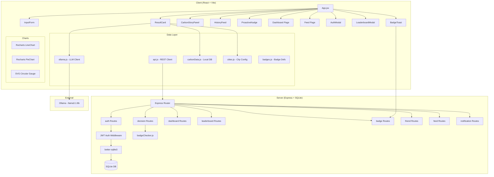
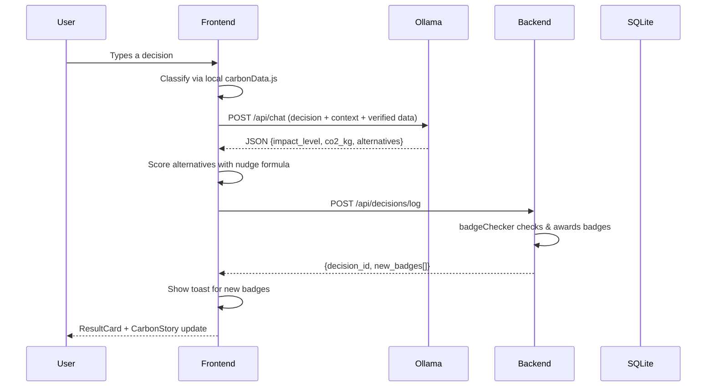

<div align="center">
  
  <h1 align="center">🌱 NudgeGreen</h1>
  <p align="center">
    <strong>Your AI-powered carbon footprint coach — track, nudge, and green your daily decisions.</strong>
  </p>
  <p align="center">
    <a href="https://github.com/Dev-Lahrani/NudgeGreen/blob/master/LICENSE"></a>
    
    
    
    
    
    
    
    <br>
    
    
    
    
  </p>

  <h3>
    <a href="#features">Features</a>
    <span> · </span>
    <a href="#demo">Demo</a>
    <span> · </span>
    <a href="#architecture">Architecture</a>
    <span> · </span>
    <a href="#tech-stack">Tech Stack</a>
    <span> · </span>
    <a href="#getting-started">Getting Started</a>
    <span> · </span>
    <a href="#api-reference">API</a>
    <span> · </span>
    <a href="#project-structure">Structure</a>
    <span> · </span>
    <a href="#roadmap">Roadmap</a>
  </h3>
</div>

---

## ✨ Features

<table>
<tr>
<td width="50%">

### 🤖 AI-Powered Impact Analysis
Type any daily decision — "ordering Zomato delivery", "taking a cab to work" — and get an instant AI analysis with:
- **CO₂ estimation** in kilograms
- **Impact level** (Low / Medium / High) with a color-coded gauge
- **Impact reason** explaining *why* it matters
- **2-3 greener alternatives** with Smart Score ratings

</td>
<td width="50%">

### 🎯 Smart Scoring
Alternatives ranked by a weighted formula:
```
Smart Score = (CO₂ saved × 0.7) + (Convenience × 0.3)
```
Normalized to a 0–100 percentage bar so you can pick the most practical green swap.

</td>
</tr>
<tr>
<td width="50%">

### 🏙️ City-Aware Adjustments
Pick your city from 10 Indian metros — each has a transit-profile multiplier (0.9–1.15) that adjusts transport CO₂ estimates based on local infrastructure.

</td>
<td width="50%">

### 📊 Curated Carbon Database
40+ pre-verified Indian decisions across **Transport**, **Food**, **Shopping**, and **Energy** categories with accurate CO₂ values, used to ground AI responses in real data.

</td>
</tr>
<tr>
<td width="50%">

### 🎮 Gamification & Badges
6 unlockable badges that reward consistent green behavior:

| Badge | Unlock Condition |
|-------|-----------------|
| 🥇 **First Step** | Log your first decision |
| 🔥 **Green Streak** | 3 consecutive low-impact days |
| 💪 **Carbon Crusher** | Save 10 kg CO₂ total |
| 🏆 **Top Nudger** | Weekly top-10 leaderboard |
| 🚗 **Road Warrior** | 5 transport decisions |
| 🌱 **Plant Parent** | 10 low-impact choices |

</td>
<td width="50%">

### 👥 Social Features
- **Friend system** — send, accept, and remove friend requests
- **Feed** — see friends' recent decisions in a timeline
- **Nudge** — "like" a friend's decision (in-app notifications)
- **Leaderboard** — weekly top-10 CO₂ savers with friend-request buttons

</td>
</tr>
<tr>
<td width="50%">

### 🌳 Carbon Story Panel
An animated SVG tree that reflects your session impact:
- **Thriving** (low CO₂) → lush green canopy
- **Moderate** → neutral state
- **Wilting** (high CO₂) → sparse, brown

Plus relatable equivalents (driving km, phone charges) and a progress bar vs. the Indian daily average (11 kg CO₂).

</td>
<td width="50%">

### 📈 Personal Dashboard
Per-user analytics including:
- Total decisions, CO₂ generated, CO₂ saved, streak
- 7-day CO₂ line chart (Recharts)
- Category-breakdown donut chart
- Weekly comparison bars
- All earned badges with unlock dates
- **Shareable impact report** — downloadable PNG via `html2canvas`

</td>
</tr>
<tr>
<td width="50%">

### 🧠 Proactive Nudges
After 5 logged decisions, the app analyzes your habits (most common category + time of day) and shows a contextual nudge — *"Hey EcoWarrior, you usually order food around lunchtime — want a greener option today?"*

</td>
<td width="50%">

### 📱 PWA Ready
- Installable on mobile home screen
- Full `beforeinstallprompt` banner
- Service worker with stale-while-revalidate caching
- Web manifest + iOS meta tags
- Offline-ready app shell

</td>
</tr>
</table>

---

## 🖼️ Demo

<div align="center">
<table>
<tr>
<td align="center"><b>Impact Analysis</b></td>
<td align="center"><b>Dashboard</b></td>
<td align="center"><b>Carbon Story</b></td>
</tr>
<tr>
<td></td>
<td></td>
<td></td>
</tr>
<tr>
<td align="center">Type a decision → get instant CO₂<br>analysis + greener alternatives</td>
<td align="center">Personal stats, charts, badges,<br>and shareable reports</td>
<td align="center">Animated tree visualizes your<br>session carbon footprint</td>
</tr>
</table>
</div>

> **Note:** Screenshots coming soon! Run the app locally to see it in action.

---

## 🏗️ Architecture



### Data Flow



---

## 🛠️ Tech Stack

| Layer | Technology | Purpose |
|-------|-----------|---------|
| **Frontend** | React 19 · React Router DOM 7 | UI framework & client-side routing |
| **Build** | Vite 8 · PostCSS · Autoprefixer | Fast dev server & optimized builds |
| **Styling** | Tailwind CSS 3 | Utility-first CSS |
| **Charts** | Recharts 3 | Responsive line, pie & bar charts |
| **State** | React hooks (useState, useEffect, useCallback, useRef) | Local state management |
| **AI/LLM** | Ollama · llama3.1:8b | Local LLM for impact analysis |
| **Backend** | Express 4 (ESM) | REST API server |
| **Database** | SQLite via better-sqlite3 | Embedded, zero-config persistence |
| **Auth** | bcryptjs · jsonwebtoken | Password hashing & JWT sessions |
| **Images** | html2canvas 1.4 | Shareable impact report PNG |
| **PWA** | Service Worker · Web Manifest · beforeinstallprompt | Mobile installability |
| **Testing** | Vitest 4 · @testing-library/react 16 · jsdom 29 | Unit & component tests |
| **Linting** | ESLint 10 · react-hooks · react-refresh | Code quality |

---

## 🚀 Getting Started

### Prerequisites

| Tool | Version | Install |
|------|---------|---------|
| Node.js | ≥ 18 | [nodejs.org](https://nodejs.org) |
| npm | ≥ 9 | ships with Node |
| Ollama | latest | [ollama.ai](https://ollama.ai) |

### 1. Clone & Install

```bash
git clone git@github.com:Dev-Lahrani/NudgeGreen.git
cd NudgeGreen

# Install frontend dependencies
npm install

# Install server dependencies
cd server && npm install && cd ..
```

### 2. Pull the LLM Model

```bash
ollama pull llama3.1:8b
```

### 3. Configure the Backend

```bash
cp server/.env.example server/.env
# Edit server/.env if needed — defaults work out of the box
```

The `.env` file contains:
```
PORT=3001
JWT_SECRET=your-secret-key-change-in-production
```

### 4. Initialize the Database

```bash
node server/initDb.js
```

This creates `server/nudgegreen.db` with all tables.

### 5. Start Ollama

```bash
ollama serve
```

### 6. Start the App

```bash
# Terminal 1: backend
node server/index.js

# Terminal 2: frontend
npm run dev
```

Open **http://localhost:5173** in your browser.

---

## 📡 API Reference

All API endpoints are prefixed with `/api`. Authenticated endpoints require a `Authorization: Bearer <token>` header.

### Authentication

| Method | Endpoint | Auth | Description |
|--------|----------|------|-------------|
| POST | `/api/auth/signup` | No | Create account `{display_name, city, password}` → `{user_id, token}` |
| POST | `/api/auth/login` | No | Log in `{display_name, password}` → `{user_id, token}` |

### Decisions

| Method | Endpoint | Auth | Description |
|--------|----------|------|-------------|
| POST | `/api/decisions/log` | Yes | Log a decision `{decision_text, category, impact_level, co2_kg}` → `{decision_id, new_badges[]}` |

### Dashboard & Stats

| Method | Endpoint | Auth | Description |
|--------|----------|------|-------------|
| GET | `/api/dashboard` | Yes | `{user, stats, daily_co2, by_category}` |
| GET | `/api/leaderboard` | Yes | Top 10 weekly CO₂ savers w/ friendship status |
| GET | `/api/badges` | Yes | All badge statuses for current user |
| GET | `/api/nudge` | Yes | Proactive nudge eligibility |

### Friends

| Method | Endpoint | Auth | Description |
|--------|----------|------|-------------|
| GET | `/api/friends` | Yes | List accepted friends |
| GET | `/api/friends/requests` | Yes | Incoming pending requests |
| POST | `/api/friends/request` | Yes | Send request `{target_user_id}` |
| POST | `/api/friends/accept` | Yes | Accept request `{requester_id}` |
| DELETE | `/api/friends/:userId` | Yes | Remove friend / reject request |

### Feed & Notifications

| Method | Endpoint | Auth | Description |
|--------|----------|------|-------------|
| GET | `/api/feed` | Yes | Friends' recent decisions (last 30) |
| POST | `/api/feed/nudge/:decisionId` | Yes | "Nudge" a decision → creates notification |
| GET | `/api/notifications` | Yes | Notifications + unread count |
| POST | `/api/notifications/read` | Yes | Mark all as read |

---

## 📁 Project Structure

```
NudgeGreen/
├── public/                      # Static assets
│   ├── favicon.svg              # Browser tab icon
│   ├── icons/                   # PWA app icons (192px & 512px SVGs)
│   ├── manifest.json            # Web App Manifest
│   └── sw.js                    # Service Worker
├── server/                      # Express backend
│   ├── routes/
│   │   ├── auth.js              # Signup / login
│   │   ├── decisions.js         # Decision logging
│   │   ├── dashboard.js         # Stats & analytics
│   │   ├── leaderboard.js       # Weekly rankings
│   │   ├── badges.js            # Badge status
│   │   ├── friends.js           # Friend CRUD
│   │   ├── feed.js              # Social feed
│   │   ├── notifications.js     # In-app notifications
│   │   └── nudge.js             # Proactive nudge logic
│   ├── middleware/auth.js        # JWT verification
│   ├── badgeChecker.js          # Badge award engine
│   ├── db.js                    # SQLite connection
│   ├── initDb.js                # Database setup
│   ├── schema.sql               # Full table DDL
│   ├── index.js                 # Express app entry
│   └── package.json
├── src/                         # React frontend
│   ├── components/
│   │   ├── AuthModal.jsx        # Login/signup modal
│   │   ├── BadgeToast.jsx       # Badge unlock toast
│   │   ├── CarbonStoryPanel.jsx # Animated tree + equivalents
│   │   ├── CityModal.jsx        # City picker
│   │   ├── HistoryFeed.jsx      # Session decision list
│   │   ├── InputForm.jsx        # Decision input + chips
│   │   ├── InstallPrompt.jsx    # PWA install banner
│   │   ├── LeaderboardModal.jsx # Weekly rankings + friends
│   │   ├── LoadingState.jsx     # Spinner
│   │   ├── ProactiveNudge.jsx   # Contextual habit suggestions
│   │   ├── ResultCard.jsx       # Impact gauge + alternatives
│   │   ├── ShareCard.jsx        # Off-screen report PNG
│   │   └── DisplayNameModal.jsx # Legacy name prompt
│   ├── data/
│   │   ├── badges.js            # Badge definitions
│   │   ├── carbonData.js        # 40 curated decision entries
│   │   └── cities.js            # 10 Indian cities config
│   ├── pages/
│   │   ├── Dashboard.jsx        # User stats & charts page
│   │   └── Feed.jsx             # Friends activity feed
│   ├── utils/
│   │   ├── api.js               # REST client (fetch + JWT)
│   │   └── ollama.js            # LLM integration
│   ├── assets/                  # Static assets
│   ├── App.jsx                  # Root component + routing
│   ├── main.jsx                 # Entry point
│   ├── index.css                # Tailwind base styles
│   └── test-setup.js            # Vitest setup
├── docs/superpowers/            # AI-generated specs & plans
├── dist/                        # Production build output
├── package.json
├── vite.config.js
├── tailwind.config.js
├── postcss.config.js
├── eslint.config.js
└── README.md
```

---

## 🧪 Running Tests

```bash
# Run all tests (watch mode)
npm test

# Run once
npm run test:run
```

Tests use **Vitest** with **@testing-library/react** and **jsdom**. Coverage includes the Ollama utility, components, and integration flows.

---

## 🗺️ Roadmap

- [x] AI-driven CO₂ impact analysis
- [x] Green alternatives with Smart Scores
- [x] City-aware carbon adjustments
- [x] User authentication & session tracking
- [x] Dashboard with charts & badges
- [x] Gamification (6 badges)
- [x] Social features (friends, feed, nudges)
- [x] Proactive behavioral nudges
- [x] PWA support (installable, offline)
- [x] Shareable impact reports
- [ ] Email/WhatsApp sharing
- [ ] Group challenges & team leaderboards
- [ ] Multi-language support (Hindi, Marathi, etc.)
- [ ] Weekly email digests with carbon savings
- [ ] Public API for external integrations
- [ ] Mobile app (React Native)

---

## 🤝 Contributing

Contributions are welcome! Please feel free to submit a Pull Request.

1. Fork the repo
2. Create your feature branch (`git checkout -b feature/amazing-feature`)
3. Commit your changes (`git commit -m 'Add amazing feature'`)
4. Push to the branch (`git push origin feature/amazing-feature`)
5. Open a Pull Request

### Development Guidelines

- Follow existing code style (no semicolons, single quotes, 2-space indent)
- Write tests for new features
- Run `npm test` before submitting
- Keep the Ollama integration stateless and testable

---

## 📄 License

Distributed under the MIT License. See `LICENSE` for more information.

---

## 🙏 Acknowledgments

- **Ollama** for making local LLMs accessible
- **Recharts** for beautiful React charting
- The Indian environmental data community for regional CO₂ benchmarks

---

<div align="center">
  <p>Made with 🌱 by <a href="https://github.com/Dev-Lahrani">Dev Lahrani</a></p>
  <p>
    <a href="https://github.com/Dev-Lahrani/NudgeGreen/issues">Report Bug</a>
    ·
    <a href="https://github.com/Dev-Lahrani/NudgeGreen/issues">Request Feature</a>
  </p>
  <p>
    <sub>If this project helped you reduce your carbon footprint, give it a ⭐!</sub>
  </p>
</div>
